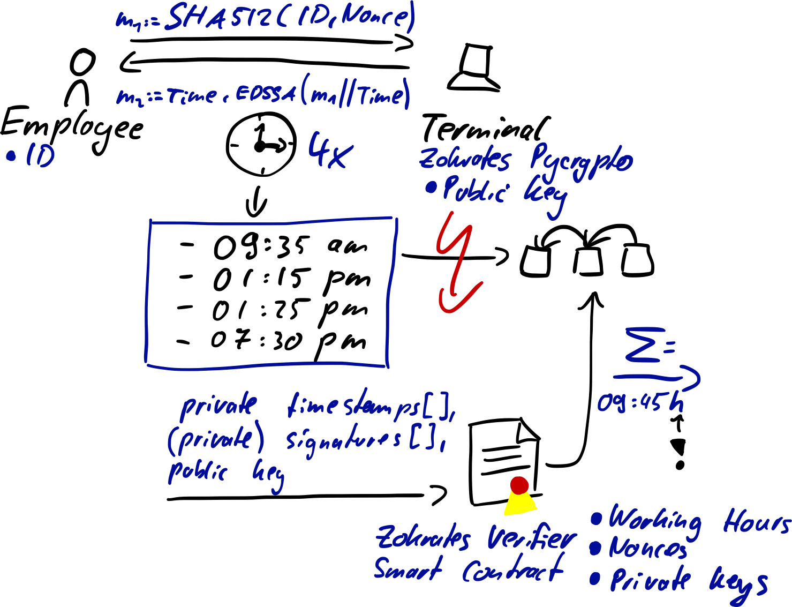

# P💥W
A zero-knowledge Proof-of-Work (PoW) to make sure that working hours of an employee conform to the European law, without knowing the details such as starting and finishing times or breaks.

## Background
To ensure "health and safety" employees in Europe, the European Court of Justice decided in a ruling ([Case number C-55/18](http://curia.europa.eu/juris/liste.jsf?num=C-55/18&language=EN)) that its mandatory for employers to track the working hours of its employees.

Although this ruling has been spoken in favor of employees, ironically it can be also be used by employers against them by profiling working hours of individuals and imposing sanctions which might be contrary to the goal of the ruling.

## Requirements
Bash scripts are optimized for Unix and the behavior is unknown for Linux! For python scripts (e.g., [`terminal.py`](./bin/terminal.py)), Python3 is required and [`pycrypto`](https://github.com/Zokrates/pycrypto) (of Zokrates project) must be on `PYTHONPATH`.

## Workflow
<p align="center">
    
</p>

## Quickstart

Clone the project
```
git clone https://github.com/robmuth/proof-of-work.git
```
Imagine going to work and checking in for the day. With the following command you will create a commitment to your employee ID (here 42) using a random a nonce and get a signed timestamp to this commitment by a terminal provided by your employer.
We'll save the signature and the private data in a file called receipt
```
echo -n $(./bin/stamp.sh -i 42) >> receipt
```
After a day of hard work you check out and we do the same appending the data to the receipt
```
echo -n $(./bin/stamp.sh -i 42) >> receipt
```
The data in the receipt is structured such that it can be used to generate a witness for the zero-knowledge proof we'll create in the following. Using Zokrates, we start by compiling the programm we will turn into a zero-knowledge proof.
```
cd ./zokrates
zokrates compile -i pow.code
```
Then we'll compute the witness based on the receipt. This will run the compiled program and check if the receipt provides a valid witness
```
cat ../receipt | zokrates compute-witness
```
If everything went fine, we are able to create the common reference string for our SNARK
```
zokrates setup
```
and generate a proof
```
zokrates generate-proof
```
This will create a proof.json which can be sent to the verifier contract. In addition to the SNARK verification, the contract will check if the signatures are created by a trusted terminal and that the nonces haven't been used before. If these checks passm then the proved working time will be added to the empolyees working time account.
